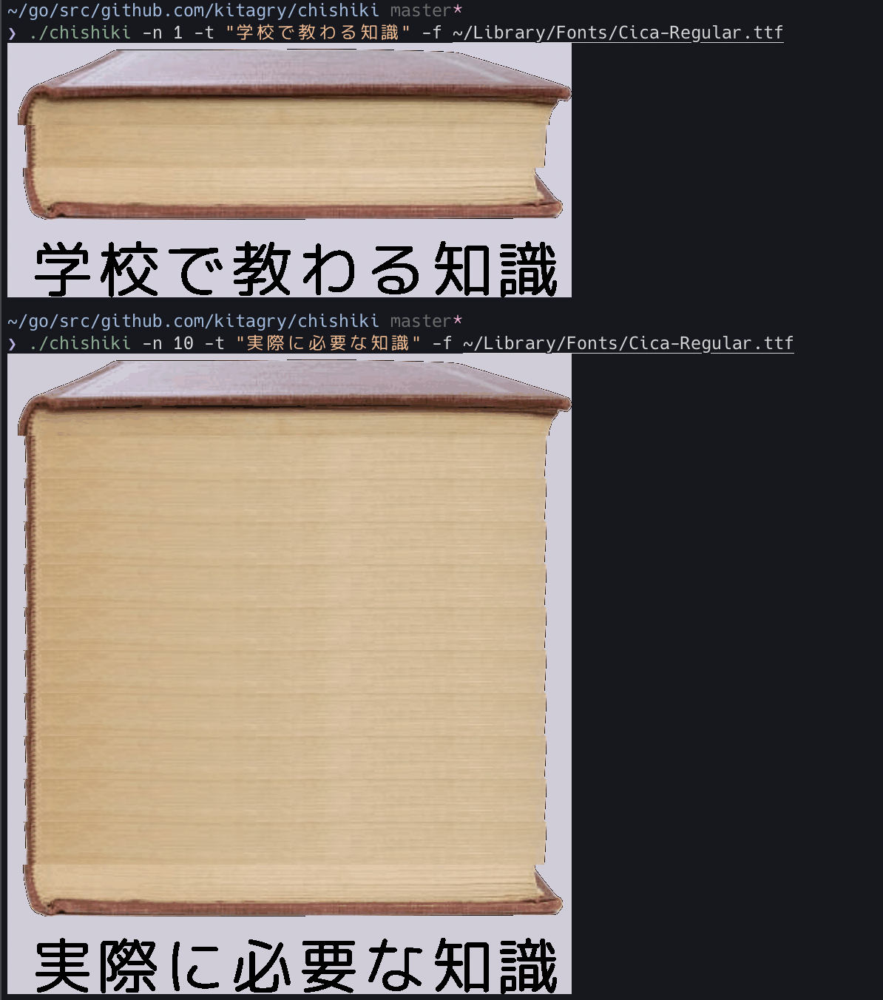

chishiki
========

最近流行りのアレ



Usage:
------

```
$ ./chishiki -n 1 -t "僕の知識" -f ~/Library/Fonts/Somthing.ttf
```

Requirements:
-------------

Sixelに対応している端末


Install:
--------

```
$ git clone github.com/kitagry/chishiki
$ go build
```

License:
--------

MIT

Author:
-------

Ryo Kitagawa
